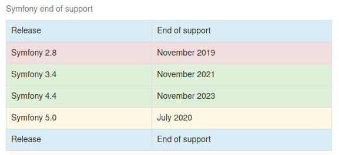

# Mysiar\Html

 PHP classes for HTML

 [](https://codecov.io/gh/mysiar/html-in-php) [](https:////packagist.org/packages/mysiar/html-in-php) [](https://packagist.org/packages/mysiar/html-in-php) [](https://packagist.org/packages/mysiar/html-in-php) [](https://packagist.org/packages/mysiar/html-in-php) [](https://app.fossa.com/projects/git%2Bgithub.com%2Fmysiar%2Fhtml-in-php?ref=badge_shield)

## Install

```
    composer require mysiar/html-in-php
```

## Tags implemented

* `<span>`
* `<div>`
* `<a>`
* `<p>`
* `<table>`
    * `<caption>`
    * `<tbody>`
    * `<thead>`
    * `<tfoot>`
    * `<tr>`
    * `<td>`

## Example


